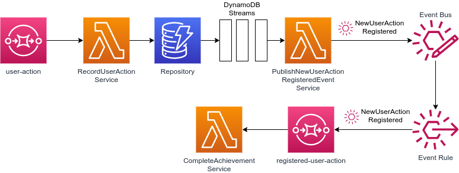

# Microservices Patterns
Implementation of any microservices patterns

## Requirements
* Docker
* AWS CDK V2

## Preparation
Some patters are implemented using AWS cloud services, so you need to deploy the infrastructure required by the patters.

For deploying patterns cloud infrastructure, first [bootstrap the environment](https://docs.aws.amazon.com/cdk/v2/guide/bootstrapping.html) (account + region) 
where you want to deploy the infrastructure by using the CDK command
```
~/project-root$ cdk bootstrap aws://ACCOUNT-NUMBER/REGION
```

After bootstrapping you can deploy the infrastructure
```
~/project-root$ cdk deploy
```

## Patterns
### Transactional Outbox & Transaction Log Tailing
This is the architecture for implementing the [Transactional Outbox pattern](https://microservices.io/patterns/data/transactional-outbox.html), 
applying [Transaction Log Tailing](https://microservices.io/patterns/data/transaction-log-tailing.html) for event relay, using AWS



